# 🔐 Enhanced Authentication Flow

## Overview

The authentication system now implements a **three-layer validation** approach to ensure users are properly authenticated:

1. ✅ **Cookie Session Check** - Verify session exists in browser cookies
2. ✅ **Database Profile Verification** - Confirm user profile exists in `user_profiles` table
3. ✅ **Role Validation** - Ensure user has a valid role (`user` or `admin`)

---

## 🔄 Authentication Flow

### **User Login Process**

```mermaid
graph TD
    A[User enters credentials] --> B[Supabase Auth validates]
    B --> C{Auth successful?}
    C -->|No| D[Show error message]
    C -->|Yes| E[Check user_profiles table]
    E --> F{Profile exists?}
    F -->|No| G[Sign out & show error]
    F -->|Yes| H{Valid role?}
    H -->|No| I[Sign out & show error]
    H -->|Yes| J[✅ Login successful]
```



### **Step-by-Step Login Validation**

#### 1. **Credential Verification** (Supabase Auth)

```typescript
// User enters email & password
const authData = await supabase.auth.signInWithPassword({ email, password });
```

#### 2. **Database Profile Check**

```typescript
// Verify profile exists in database
const profile = await getUserProfile(authData.user.id);

if (!profile) {
    // Profile doesn't exist - sign out and deny access
    await supabase.auth.signOut();
    return error: 'Account not properly set up'
}
```

#### 3. **Role Validation**

```typescript
// Ensure user has valid role
if (profile.role !== 'user' && profile.role !== 'admin') {
    // Invalid role - sign out and deny access
    await supabase.auth.signOut();
    return error: 'Account does not have proper permissions'
}
```

#### 4. **Success**

```typescript
// All checks passed
console.log(`✅ User logged in: ${profile.email} (${profile.role})`);
return { success: true, user, session, profile };
```

---

## 🔒 Session Validation (Cookie Check)

### **On Page Load / App Initialization**

When the app starts, it checks for an existing session:

```typescript
// Step 1: Check cookies for session
const session = await authService.getCurrentSession();

if (session?.user) {
  // Step 2: Verify profile in database
  const profile = await authService.getUserProfile(session.user.id);

  if (!profile || !isValidRole(profile.role)) {
    // Invalid - sign out
    await authService.signOut();
  } else {
    // Valid - user is logged in
    setAuthenticatedUser(user, profile, session);
  }
}
```

### **Console Output**

You'll see detailed logging during authentication:

```
🔐 Initializing authentication...
📝 Session found in cookies for user: user@example.com
✅ Authentication validated: user@example.com (admin)
```

Or if validation fails:

```
🔐 Initializing authentication...
📝 Session found in cookies for user: user@example.com
❌ User profile not found in database. Logging out...
```

---

## 🛡️ Security Features

### **1. Automatic Sign-Out on Invalid State**

If any validation fails, the user is automatically signed out:

- ❌ No profile in database → Sign out
- ❌ Invalid role → Sign out
- ❌ Database error → Sign out

### **2. Role-Based Access Control (RBAC)**

Only two roles are allowed:

- `user` - Standard user access
- `admin` - Administrative privileges

Any other value is considered invalid.

### **3. Double Verification**

Every authentication attempt is verified twice:

1. Supabase Auth (credentials)
2. Database profile (existence + role)

---

## 📊 Authentication States

| State              | Cookie Session | Database Profile | Valid Role | Result            |
| ------------------ | -------------- | ---------------- | ---------- | ----------------- |
| ✅ Authenticated   | ✅ Exists      | ✅ Exists        | ✅ Valid   | **Logged In**     |
| ❌ Not Logged In   | ❌ None        | -                | -          | **Logged Out**    |
| ❌ Invalid Profile | ✅ Exists      | ❌ Missing       | -          | **Auto Sign Out** |
| ❌ Invalid Role    | ✅ Exists      | ✅ Exists        | ❌ Invalid | **Auto Sign Out** |

---

## 🔧 Implementation Details

### **Enhanced `signIn()` Function**

```typescript
export const signIn = async (data: SignInData): Promise<AuthResponse> => {
    // 1. Authenticate with Supabase
    const { data: authData } = await supabase.auth.signInWithPassword(...);

    // 2. Verify profile exists
    const profile = await getUserProfile(authData.user.id);
    if (!profile) {
        await supabase.auth.signOut();
        return { success: false, error: '...' };
    }

    // 3. Validate role
    if (profile.role !== 'user' && profile.role !== 'admin') {
        await supabase.auth.signOut();
        return { success: false, error: '...' };
    }

    // 4. Success
    return { success: true, user, session, profile };
};
```

### **Enhanced `AuthContext` Initialization**

```typescript
useEffect(() => {
  const initAuth = async () => {
    // 1. Check cookies
    const session = await authService.getCurrentSession();

    if (session?.user) {
      // 2. Verify database profile
      const profile = await authService.getUserProfile(session.user.id);

      // 3. Validate or sign out
      if (!profile || !isValidRole(profile.role)) {
        await authService.signOut();
        clearAuthState();
      } else {
        setAuthenticatedUser(user, profile, session);
      }
    }
  };

  initAuth();
}, []);
```

### **New `validateSession()` Helper**

A utility function to check session validity:

```typescript
const validation = await authService.validateSession();

if (validation.isValid) {
  // User is authenticated
  const { user, profile, session } = validation;
} else {
  // User is not authenticated
  console.log("Reason:", validation.reason);
}
```

---

## 🎯 Use Cases

### **Use Case 1: User Logs In**

1. User enters email and password
2. Supabase Auth validates credentials ✅
3. System checks `user_profiles` table ✅
4. User has role `user` ✅
5. **Result:** User is logged in and can access the site

### **Use Case 2: Admin Logs In**

1. Admin enters email and password
2. Supabase Auth validates credentials ✅
3. System checks `user_profiles` table ✅
4. User has role `admin` ✅
5. **Result:** Admin is logged in and can access admin panel

### **Use Case 3: User Without Profile**

1. User enters email and password
2. Supabase Auth validates credentials ✅
3. System checks `user_profiles` table ❌ (not found)
4. System signs user out immediately
5. **Result:** Error message - "Account not properly set up"

### **Use Case 4: User Refreshes Page**

1. Browser sends cookies to server
2. System finds active session ✅
3. System checks `user_profiles` table ✅
4. User has valid role ✅
5. **Result:** User remains logged in

### **Use Case 5: Corrupted Database**

1. Browser sends cookies to server
2. System finds active session ✅
3. System tries to check `user_profiles` table ❌ (error)
4. System signs user out for safety
5. **Result:** User is logged out, must sign in again

---

## 🔍 Error Messages

| Scenario         | Error Message                                                            |
| ---------------- | ------------------------------------------------------------------------ |
| No profile in DB | "Your account is not properly set up. Please contact support."           |
| Invalid role     | "Your account does not have proper permissions. Please contact support." |
| Auth failed      | "Invalid email or password. Please try again."                           |
| Database error   | "An unexpected error occurred during sign in."                           |

---

## 🚀 Testing the Flow

### **Test 1: Normal Login**

1. Create a user account
2. Run the database fix script to ensure profile exists
3. Log in with credentials
4. **Expected:** Success, profile loads

### **Test 2: Deleted Profile**

1. Log in normally
2. Manually delete profile from database
3. Refresh the page
4. **Expected:** Auto sign out with error

### **Test 3: Invalid Role**

1. Log in normally
2. Manually change role to `invalid` in database
3. Refresh the page
4. **Expected:** Auto sign out with error

### **Test 4: Cookie Persistence**

1. Log in normally
2. Close browser
3. Reopen and navigate to site
4. **Expected:** Still logged in (if cookies persist)

---

## 📝 Console Logging

The system provides detailed console logs for debugging:

### **Successful Login:**

```
🔐 Initializing authentication...
📝 Session found in cookies for user: admin@example.com
✅ Authentication validated: admin@example.com (admin)
🔄 Auth state changed: INITIAL_SESSION
✅ Session validated: admin@example.com (admin)
```

### **Failed Validation:**

```
🔐 Initializing authentication...
📝 Session found in cookies for user: user@example.com
❌ User profile not found in database. Logging out...
ℹ️ Session ended - logging out
```

### **New Login:**

```
🔄 Auth state changed: SIGNED_IN
📝 New session detected for user: user@example.com
✅ Session validated: user@example.com (user)
✅ User logged in successfully: user@example.com (user)
```

---

## 🔐 Best Practices

1. **Always validate on both client and server**

   - Client validation is for UX
   - Server (database) validation is for security

2. **Never trust cookies alone**

   - Cookies can be manipulated
   - Always verify against database

3. **Fail securely**

   - If in doubt, sign out
   - Better to inconvenience than compromise security

4. **Log everything (in development)**

   - Detailed logs help debugging
   - Remove sensitive logs in production

5. **Use TypeScript types**
   - Type safety prevents bugs
   - Makes code more maintainable

---

## 🛠️ Maintenance

### **Adding New Roles**

To add a new role (e.g., `moderator`):

1. Update the database enum:

```sql
ALTER TYPE user_role ADD VALUE 'moderator';
```

2. Update TypeScript type:

```typescript
export type UserRole = "user" | "admin" | "moderator";
```

3. Update validation logic:

```typescript
const validRoles = ["user", "admin", "moderator"];
if (!validRoles.includes(profile.role)) {
  // Invalid role
}
```

### **Monitoring Authentication**

Check for authentication issues:

```sql
-- Users with no profile
SELECT u.id, u.email
FROM auth.users u
LEFT JOIN user_profiles p ON u.id = p.id
WHERE p.id IS NULL;

-- Users with invalid roles
SELECT * FROM user_profiles
WHERE role NOT IN ('user', 'admin');
```

---

## 📚 Related Files

- `frontend/services/authService.ts` - Auth logic and validation
- `frontend/contexts/AuthContext.tsx` - React context with validation
- `frontend/components/SigninButton.tsx` - UI component
- `supabase/migrations/20251021000000_create_user_profiles_and_rbac.sql` - Database schema

---

## ✅ Summary

**The authentication system now ensures:**

✅ Users must exist in `auth.users` (Supabase Auth)  
✅ Users must have a profile in `user_profiles` (Database)  
✅ Users must have a valid role (`user` or `admin`)  
✅ Sessions are validated on every page load  
✅ Invalid states trigger automatic sign-out  
✅ Detailed logging for debugging  
✅ Type-safe implementation

**This provides a secure, reliable authentication flow that validates users at multiple levels!** 🎉
